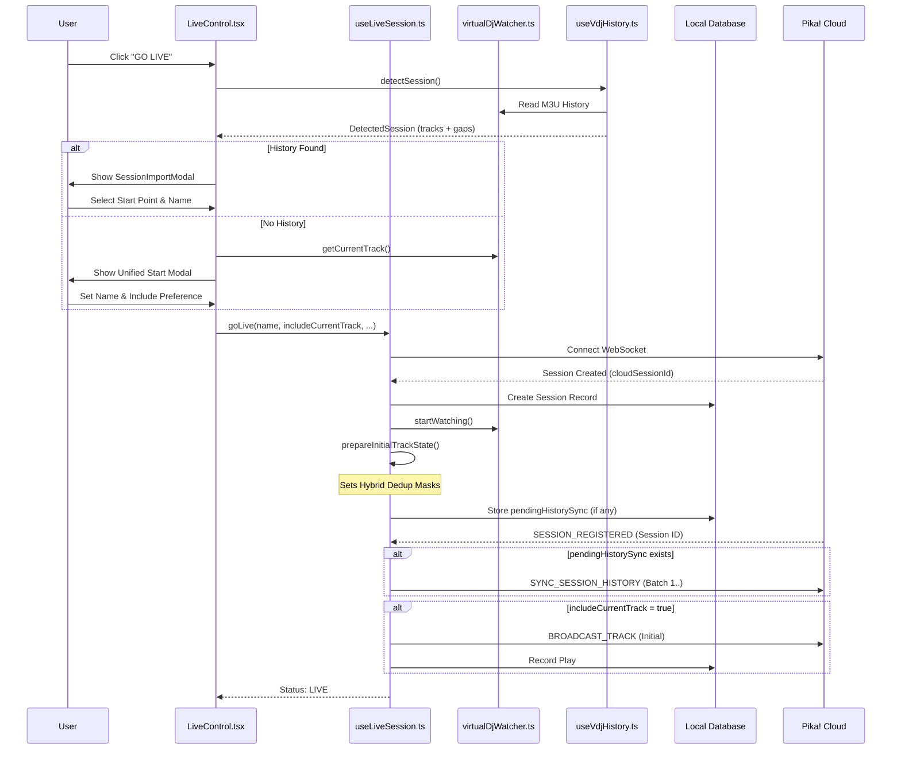

# Go Live & Session Initialization Flow

This document outlines the technical flow of starting a live session in Pika!, including VirtualDJ history detection and initial track handling.

## Overview

The "Go Live" process is orchestrated by the `LiveControl` component and powered by the `useLiveSession` hook. It transforms local VirtualDJ play state into a globally synchronized live session.

## Flow Diagram

## Key Mechanisms

### 1. Hybrid Deduplication
To prevent "rolling window" duplicates (where a track is recorded both by history import and the real-time watcher), we use a hybrid mask:
- **Timestamp Window**: Tracks with the same Artist-Title within a 3-minute window are treated as the same play.
- **Initialization Mask**: When starting a session, the current track is proactively marked as "processed" in the dedup window to ensure the watcher doesn't record it again immediately.

### 2. Session Gap Detection
`useVdjHistory` identifies session boundaries by looking for a **30-minute silence** between consecutive tracks. This allows us to offer the user a clean "resume" point if they've been playing for a while before deciding to go live.

### 3. The "Bridge" Track
When importing history, there is often a track currently on the decks.
- If the current track is effectively the *last* track in the history, it's a **Seamless Transition**.
- If the current track is new, it's a **Bridge Required** scenario where the track is added to the set history immediately upon going live.

## State Transitions

| State | Trigger | Action |
| :--- | :--- | :--- |
| **Idle** | Initial | Showing "GO LIVE" button |
| **Detecting** | "GO LIVE" Click | Reading VDJ history files |
| **Prompting** | History Found | Choosing starting point / naming |
| **Connecting** | `goLive()` called | WebSocket handshake & DB init |
| **Live** | WebSocket OPEN | Real-time broadcasting active |
| **Syncing** | Socket Closed | Queuing plays in Offline Queue |
