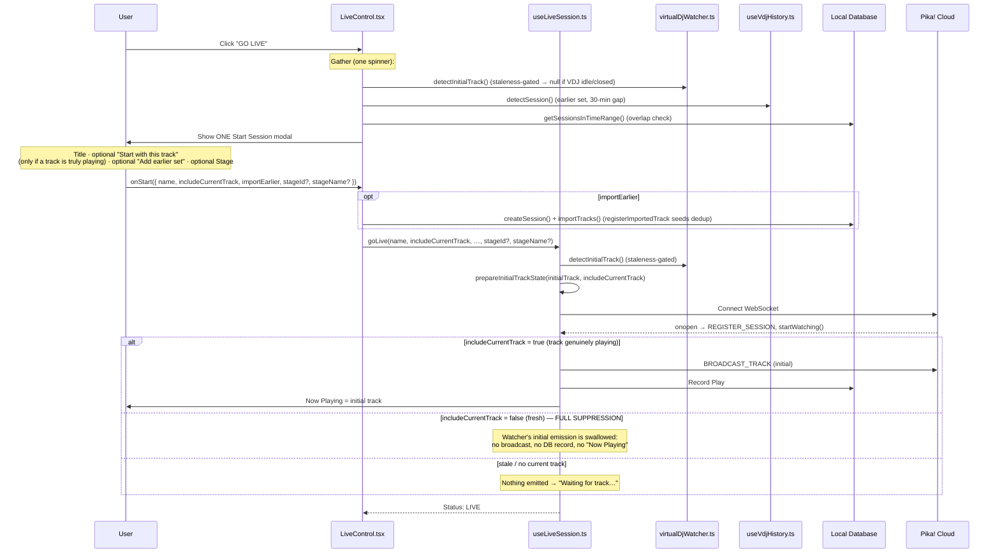

# Go Live & Session Initialization Flow

This document outlines the technical flow of starting a live session in Pika!, including VirtualDJ history detection and initial-track handling.

## Overview

The "Go Live" process is orchestrated by the `LiveControl` component and powered by the `useLiveSession` hook. It transforms local VirtualDJ play state into a globally synchronized live session.

**Core principle:** "Now Playing" reflects what is *actually* playing right now. A session started "fresh" shows nothing until VirtualDJ reports a genuinely current track — even if a stale track is still sitting at the end of `history.m3u` (e.g. VDJ is closed/idle).

## Flow Diagram

## Key Mechanisms

### 1. Liveness / staleness gate (the source of truth)
`history.m3u` is an append-only log: its **last line is the last-played track and persists even after VirtualDJ is closed**. So the last entry is only treated as "currently playing" if it is **fresh**.

- `isTrackFresh(track)` + `INITIAL_TRACK_FRESHNESS_MS` (15 min) — `services/virtualDjWatcher.ts`.
- `detectInitialTrack()` returns `null` when the latest entry is stale (`connectionManager.ts`).
- The watcher's **initial** emission in `startWatching()` is gated on freshness; ongoing real-time change-events are always trusted.

Result: with VDJ idle/closed there is simply **no current track**, so a fresh session starts clean.

### 2. "Don't include" = full suppression
When the DJ starts fresh while a track *is* genuinely playing, `prepareInitialTrackState()` (skip path) seeds the broadcast-dedup key and marks the track processed. `handleTrackChange()` matches that key on the watcher's first emission and **returns early** — no `setNowPlaying`, no `recordPlay`, no `broadcastTrack`. The flag is consumed once, so the next (different) track flows normally.

> Note: this replaces the previous "visibility-only broadcast" behavior, where a skipped track was still broadcast to dancers and the cloud recap. `includeCurrentTrack=false` now means *nothing* about the pre-existing track is shown, broadcast, or recorded.

### 3. Hybrid deduplication (ongoing plays)
To prevent "rolling window" duplicates (a track recorded twice as the 60s window rolls over, or both via import and the live watcher):
- **Window**: `${artist}-${title}-${floor(now/60000)}` (`TRACK_DEDUP_WINDOW_MS = 60000`).
- **Absolute interval**: the same Artist-Title is blocked for `MIN_REPLAY_INTERVAL_MS` (2 min).
- **Import overlap**: `registerImportedTrack()` seeds the absolute map so an imported track that's still on the decks isn't re-recorded by the live watcher (while still broadcasting so dancers see it).

### 4. Session-gap detection (optional earlier-set import)
`useVdjHistory.detectSession()` identifies a prior set by a **30-minute silence** between consecutive tracks. This is offered as an **opt-in** "Add my earlier set" toggle inside the single Start modal — it is no longer a separate, blocking step. If those tracks overlap an existing local session, an **inline warning** is shown (instead of a dedicated duplicate-warning modal).

### 5. Optional Stage (seamless DJ rotation)
When a Stage is selected, `goLive()` carries `stageId`/`stageName` into `REGISTER_SESSION`. The cloud marks that session as the stage's active one (`stageActiveSession`), so dancers who joined the **stage** (`SUBSCRIBE_STAGE`, e.g. via a `/stage/{id}` URL or a stage QR) follow DJ rotation without rescanning. The desktop QR targets the **stage** when staged (else the session), and the live HUD shows a stage badge. Standalone (no stage) is unchanged. See [stage-event-model.md](./stage-event-model.md).

## The Start Session modal (`StartSessionModal.tsx`)
A single modal replaces the previous duplicate-warning → import → name modal chain. Sections appear only when relevant:
- **Set title** (always).
- **"Start with this track"** toggle — only when a track is genuinely playing (default ON).
- **"Add my earlier set"** toggle — only when `detectSession()` finds one (default OFF); reveals a start-from selector, a preview, and the inline overlap warning.
- **Stage** (`StageSelector`, optional, collapsed by default) — broadcast to a persistent venue **Stage** instead of a standalone session. Three modes: **Pick** (the DJ's owned event → stage), **Create** (spin up an Event + Stage as organizer), **Join** (paste a stage code to broadcast onto a stage you don't own — guest-DJ / cross-owner rotation). Emits `{ id, name }` → `stageId`/`stageName`.

## State Transitions

| State | Trigger | Action |
| :--- | :--- | :--- |
| **Idle** | Initial | Showing "GO LIVE" button |
| **Detecting** | "GO LIVE" click | Gathering current track + history (one spinner) |
| **Prompting** | Gather done | Single Start Session modal |
| **Connecting** | `goLive()` called | WebSocket handshake & DB init |
| **Live** | WebSocket OPEN | Real-time broadcasting active |
| **Syncing** | Socket closed | Queuing plays in the offline queue |
