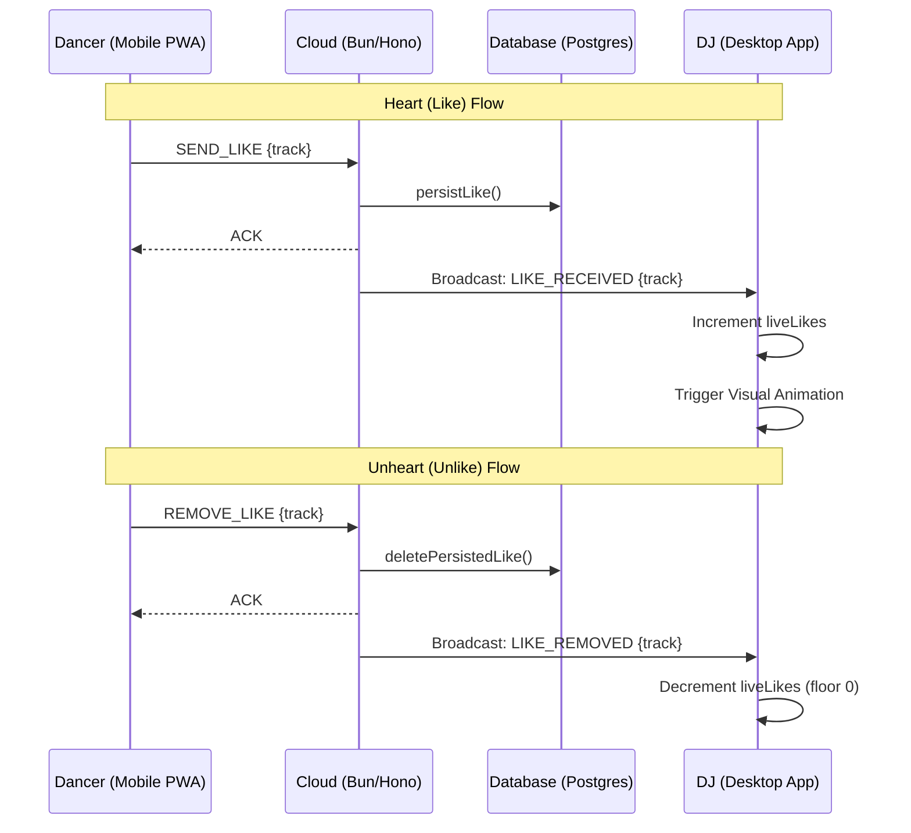

# Heart & Unheart Logic

The "Heart" pattern is a core micro-interaction in Pika! that allows Dancers to provide real-time sentiment to the DJ. This document outlines the architectural flow, message protocol, and data integrity measures.

## Architectural Flow

The flow is a real-time loop spanning the Dancer PWA, Cloud Service, and DJ Desktop App.



## Message Protocol (WebSockets)

### From Dancer -> Server
- **`SEND_LIKE`**: Sent when a user taps the heart.
- **`REMOVE_LIKE`**: Sent when a user taps the heart again to "undo".
- **`SEND_BULK_LIKE`**: Sent upon reconnection to sync likes made while offline. Carries a `messageId`; the client clears its IndexedDB queue only after the matching `ACK` (see *Offline Queue* below).

### From Server -> Client (Broadcasting)
- **`LIKE_RECEIVED`**: Broadcast to all session subscribers (usually the DJ only cares).
- **`LIKE_REMOVED`**: Broadcast when a like is undone.

## Database Schema & Integrity

### Table: `likes`
| Column | Type | Description |
| :--- | :--- | :--- |
| `id` | serial | Primary Key |
| `sessionId` | text | References `sessions.id` |
| `clientId` | text | Anonymous browser ID |
| `playedTrackId` | integer| References `played_tracks.id` |
| `createdAt` | timestamp | Internal timestamp |

### Idempotency (Unique Constraint)
To prevent duplicate likes from the same client appearing on the DJ's dashboard (due to network retries or offline sync), a **unique composite constraint** is enforced:
```sql
UNIQUE (session_id, client_id, played_track_id)
```
This ensures that at the database level, a dancer can only "Heart" a specific track *instance* once per session.

## UI Logic & Optimizations

### Mobile Web (Dancer)
- **Optimistic UI**: The heart icon fills immediately.
- **Offline Queue (ACK-gated)**: Likes are stored in IndexedDB if the connection is lost and flushed via `SEND_BULK_LIKE` on reconnect. The IndexedDB entry is removed **only after the server ACKs** the batch (`hooks/live/ackRegistry.ts`); an un-ACKed flush (timeout/NACK) is kept and retried on the next reconnect. `WebSocket.send()` only buffers bytes and doesn't throw on a mid-flight drop, so clearing before the ACK silently lost likes on flaky wifi. Re-flush is safe via the idempotency constraint above.
- **Rate Limiting**: Users are restricted to a maximum number of likes per minute to prevent botting.

### Desktop App (DJ)
- **Debounced Persistence**: While the counter updates instantly in memory, the persistence to the long-term database record in `played_tracks.likes` is debounced by 2 seconds to aggregate rapid feedback bursts.
- **Counter Safety**: The counter uses `Math.max(0, count - 1)` for unhearts to ensure it never displays negative numbers due to edge-case message reordering.
