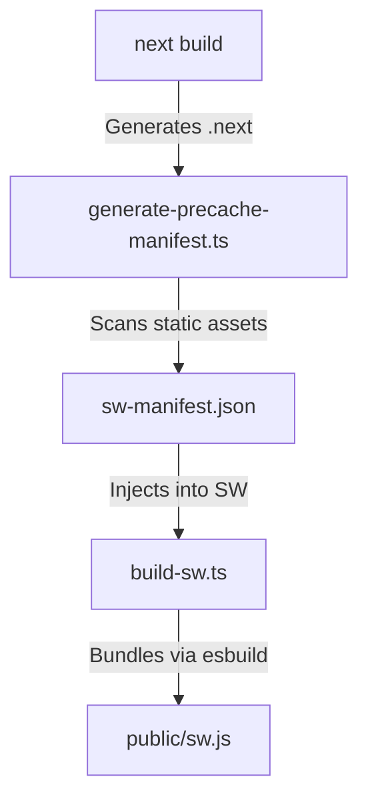

# Architecture: Progressive Web App (PWA) System

**Status:** ✅ Production Ready (v2.0)
**Last Updated:** January 26, 2026
**Scope:** `@pika/web`, `@pika/cloud`

---

## 1. Executive Summary

Pika! utilizes a "Native-Lite" PWA architecture designed for intermittent connectivity environments (clubs, basements, festivals). It combines **aggressive caching** for instant loads with **resilient synchronization** strategies for interactivity.

### Key Capabilities
| Capability | Implementation | Value |
| :--- | :--- | :--- |
| **Installable** | Web App Manifest + iOS Polyfills | Home screen presence, standalone mode. |
| **Offline-First** | Service Worker (Serwist) | Instant load, 0.3s repeat visits. |
| **Push Notifications** | Web Push API (VAPID) | Re-engagement for polls/announcements. |
| **Resilient Sync** | IndexedDB + Wake-Lock | Queues actions when offline. |
| **Battery Aware** | Wake-Up Heuristics | Pauses websocket when backgrounded. |

---

## 2. Infrastructure Architecture

The PWA system spans the Build Pipeline, Client Runtime, and Cloud Infrastructure.

### 2.1 The Custom Build Pipeline
Due to conflicts between Next.js 16, Sentry, and common PWA plugins, Pika! uses a **decoupled, manual build pipeline**.



**Why this matters:**
*   **Zero Dependencies:** No fragile `next-pwa` wrapper plugins.
*   **Sentry Compat:** Independent of Webpack hooks.
*   **Reliability:** 100% predictable output.

### 2.2 Service Worker Strategy (`sw.ts`)
We use **Serwist** (generic service worker library) with a bifurcated caching strategy:

1.  **NetworkOnly (`/api/*`, `/live/*`):**
    *   **Rule:** Real-time data must NEVER be cached by the Service Worker.
    *   **Reasoning:** Stale poll data causes confusion. We rely on application-level state (React Query / WebSocket) for data freshness.

2.  **CacheFirst (Static Assets):**
    *   **Rule:** JS, CSS, Fonts, Images.
    *   **Reasoning:** UI shell should load instantly.
    *   **Precache:** ~60 critical files are downloaded on install.

---

## 3. Push Notification Architecture

Pika! implements the **VAPID (Voluntary Application Server Identification)** standard for password-less, authenticated push notifications.

### 3.1 The "Two-Phase" Handshake

```
[Dancer's Phone]                          [Pika Cloud]                     [FCM / Apple]
       |                                       |                                 |
       | 1. Request Permission                 |                                 |
       |-------------------------------------->|                                 |
       |                                       |                                 |
       | 2. Generate Subscription (PushManager)|                                 |
       |    (endpoint + p256dh + auth)         |                                 |
       |                                       |                                 |
       | 3. POST /api/push/subscribe           |                                 |
       |-------------------------------------->| 4. Validate VAPID Signature     |
       |                                       | 5. Store in Postgres            |
       |                                       |    (dj_users table?)            |
       |                                       |    (push_subscriptions table)   |
```

### 3.2 Secure Broadcast Flow
When a DJ sends an announcement ("Pizza at midnight!"), the flow is:

1.  **Verification:** DJ token authenticated via middleware.
2.  **Rate Limiting:** Sliding window (10 req/min) per DJ to prevent spam.
3.  **Targeting:** Select subscriptions linked to the DJ (or specific criteria).
4.  **Encryption:** Payload encrypted using the user's public key (`p256dh`).
5.  **Dispatch:** Sent to Push Service (FCM/Apple) signed with our Private VAPID Key.

**Database Schema:**
See `packages/cloud/src/db/schema.ts` (`push_subscriptions` table) for field definitions.

---

## 4. Offline & Sync Reliability

### 4.1 The "Bunker Mode" Queue
When the network fails, user actions must not be lost.

*   **Write Path:**
    1.  User clicks "Like".
    2.  `useLikeQueue` detects `socket.readyState !== OPEN`.
    3.  Action written to **IndexedDB** (`idb-keyval`).
    4.  UI shows "Offline - Queued".

*   **Read/Flush Path:**
    1.  Network restored (`window.ononline` or socket reconnection).
    2.  Queue read from IndexedDB.
    3.  Items batched and sent.
    4.  Queue cleared **only on ACK**.

### 4.2 The "Wake-Up" Problem (iOS)
Mobile browsers freeze background tabs. When a user unlocks their phone after 20 minutes, the WebSocket is dead but the UI looks "connected".

**Solution: `useWakeupSync`**
1.  Listens for `document.visibilitychange`.
2.  If visible AND TimeSinceLastHeartbeat > 60s:
3.  **Force Reconnect:** Destroy old socket, create new one.
4.  **Optimistic Refresh:** Re-fetch `/active-session` API.

---

## 5. Updates & Lifecycle

### 5.1 The Update Toast
We do **not** force-reload users when a new version is deployed (it interrupts voting).

1.  **Detection:** SW polls for updates (hourly) or on navigation.
2.  **Waiting State:** New SW installs but waits in `waiting` state.
3.  **UI Prompt:** Toast appears: "Update Available - [Refresh]".
4.  **Action:**
    *   User clicks [Refresh].
    *   Client posts `SKIP_WAITING` message to SW.
    *   SW takes control.
    *   Page reloads (`controllerchange` event).

---

## 6. Security Considerations

| Vector | Mitigation |
| :--- | :--- |
| **Notification Spam** | Rate limits (10/min) + User can revoke permission in OS. |
| **Spoofing** | VAPID JWT signature required for all push messages. |
| **Stale Data** | `NetworkOnly` strategy for API routes prevents serving old poll results. |
| **XSS in Push** | Push payloads are JSON data only; Service Worker handles display logic. |

---

## 7. Device Support Matrix

| OS | Browser | Install | Push | Offline |
| :--- | :--- | :--- | :--- | :--- |
| **iOS 16.4+** | Safari | ✅ (Manual) | ✅ | ✅ |
| **iOS <16.4** | Safari | ✅ (Manual) | ❌ | ✅ |
| **Android** | Chrome | ✅ (Prompt) | ✅ | ✅ |
| **Desktop** | Chrome/Edge | ✅ (Badge) | ✅ | ✅ |
| **Desktop** | Firefox | ❌ | ✅ | ✅ |

---

## 8. Development Guide

### Key Files
*   `packages/web/src/app/sw.ts` - Service Worker Logic.
*   `packages/web/src/components/pwa/RegisterPWA.tsx` - Browser Registration & Events.
*   `packages/cloud/src/services/push.ts` - VAPID Signing & Sending.
*   `packages/web/scripts/build-sw.ts` - The Build Pipeline.

### Commands
```bash
# Verify PWA compliance
bun run scripts/verify-pwa.ts

# Generate VAPID keys (for .env)
npx web-push generate-vapid-keys
```
